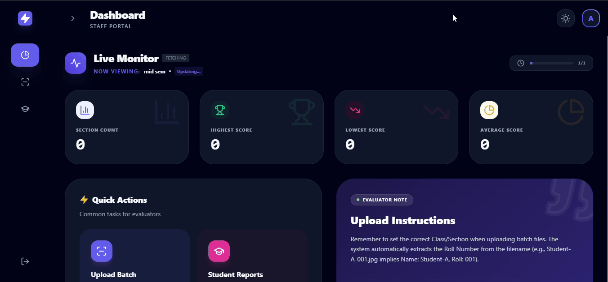
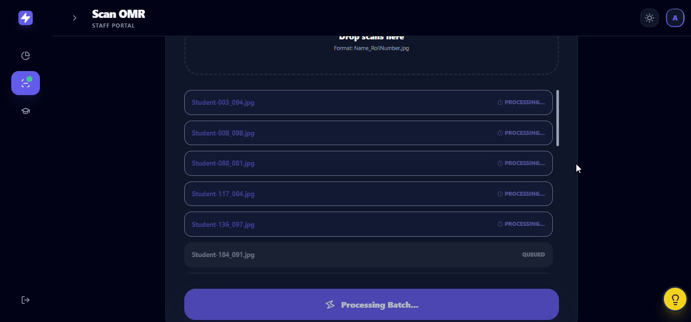

# 📝 OMR Processing Web Application

A cloud-native, device-agnostic solution designed to democratize high-volume examination processing.

---

## 🔗 Live Demo & Access
Experience the application here 👇🏽:  
**[omr-scanner-poseidon.vercel.app](https://omr-scanner-poseidon.vercel.app/)**

---

## 🔐 Demo Credentials
Please use the following credentials to explore the test environment.  
⚠️ Do not upload sensitive personal data.

| Role  | Username | Password |
|------|---------|----------|
| Admin | admin | admin | |
| Staff | generated by Admin | generated by Admin |

---

## 📸 Visual Showcase

### 🎯 The "Pulse" Dashboard
**Real-time analytics showing **total count, maximum, minimum, and average scores**.**


### ⚡ Batch Processing UI
**Parallel processing interface for **high-volume uploads**.**


---

## 🏗️ The Engineering Narrative

### 1. The Genesis: Solving the **"Scale vs. Cost"** Dilemma

In any growing college, exam season creates a tough choice. When 1,000 students sit for a test, they leave behind a mountain of OMR sheets. The faculty is stuck: do they spend weeks grading by hand—risking burnout and mistakes—or does the institute burn its budget on expensive industrial hardware?

We built this project to offer a third option.

We realized the solution wasn't better hardware; it was smarter software. By moving the heavy lifting to the cloud, we created a system that delivers 99.5% accuracy using just a standard office scanner. It turns a logistical headache into a simple, digital workflow.

---

### 2. Architecture & Capabilities

While many OMR systems are monolithic, our architecture is role-specific and data-driven. We clearly distinguish between the **Manager** (Admin) and the **Executor** (Staff).

-   **📊 The "Pulse" Dashboard:** The Staff interface is not just a data-entry terminal; it is an analytical tool. Upon login, staff members are greeted with **Live Statistics**, tracking total counts, max/min scores, and average performance immediately.
    
-   **🔍 The Filter Engine:** We built a robust retrieval system where staff can drill down into results. Whether they need a broad report for a whole Exam, a specific Class list, or an individual Student’s report card, the engine filters and generates the PDF/Excel on demand.
    
-   **🔀 Multi-Set Support:** Recognizing that secure exams use multiple question sets to prevent cheating, our system natively supports **Multi-Set Processing** (Sets A, B, C, etc.) within a single exam batch.

---

## ⚙️ Operational Protocol (The Golden Path)

To maintain high accuracy and a lightweight footprint, the system operates on a **"Strict Protocol" rather than "Guesswork"**.

---

### 🧑‍💼 1. Admin Protocol (Setup)

-   **Naming Discipline:** Admins must follow a strict naming convention when creating exams: `ExamName_Class` (e.g., `MidTerm_Class10`). This ensures logical sorting in the backend.
    
-   **The Answer Key:** The Admin uploads the Answer Key (`.xlsx`) during creation. 
 
    _Note: Keys are immutable to prevent retroactive tampering._

---

### 🧑‍🏫 2. Staff Protocol (Execution)

Success relies on organization _before_ the upload. We assume staff will organize their local files logically:

```
📂 PC Storage
 └── 📂 Exam Name (Science_MidTerm)
      └── 📂 Class Name (10)
           └── 📂 Set Code (Set_A)
                └── 📄 StudentName_RollNumber.jpg
```

-   **Identity Encoding:** The file name acts as the identifier. We strictly use `StudentName_RollNumber.jpg`.
    
-   **Hardware Assumption:** Inputs must come from a flatbed scanner (300 DPI) using a **Black Pen** on our standardized 100-question layout.

---

## 🚧 Engineering Boundaries (v1.0)

We believe in transparency. We prioritized **Data Integrity** over **Flexibility**:

-   **Immutable Answer Keys:** If a wrong key is uploaded, the exam must be deleted and recreated.
    
-   **Rigid Security:** Passwords cannot be reset by the user, only **regenerated** by the Admin.
    
-   **Controlled Velocity:** The processing engine handles images in **parallel batches of 5** to prevent server timeouts.
    
-   **Input Rigidity:** We do not attempt to guess at smudged, folded, or rotated images. If quality is compromised, the system rejects it.

---

## 🔮 The Horizon (Roadmap)

This project is a **living system**. Upcoming enhancements:

- [ ] **Security Evolution:** Integration of Email/SMS for OTP verification.
- [ ] **Academic Depth:** Subject Categorization (e.g., Q1-50: Math) and Negative Marking support.
- [ ] **Digital Storage:** Option to archive scanned images on institutional cloud drives.
- [ ] **Direct Access:** Emailing report cards directly to students.
- [ ]  **The Desktop Leap:** A Standalone `.exe` version for offline, lightning-fast processing.

---
## 👥 Meet the Developers

We are passionate builders focused on solving real-world educational problems.

**[NISCHAYA PADHI](https://www.linkedin.com/in/nischayapadhi/)**

**[JAYANT MALHOTRA](https://www.linkedin.com/in/jaybuddyjay/)**


📘 **Note**  
Detailed user guides and sample datasets are available via the **“Guide”** button inside the web application.
